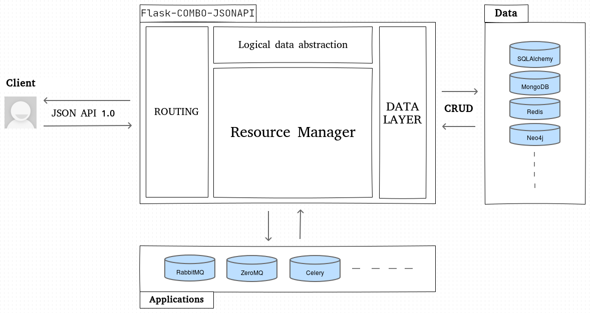

Flask-COMBO-JSONAPI
==================
.. image:: https://github.com/AdCombo/flask-combo-jsonapi/workflows/Python%20tests%20and%20coverage/badge.svg
   :alt: flask-combo-jsonapi actions
   :target: https://github.com/AdCombo/flask-combo-jsonapi/actions
.. image:: https://coveralls.io/repos/github/AdCombo/flask-combo-jsonapi/badge.svg
   :alt: flask-combo-jsonapi coverage
   :target: https://coveralls.io/github/AdCombo/flask-combo-jsonapi
.. image:: https://img.shields.io/pypi/v/flask-combo-jsonapi.svg
   :alt: PyPI
   :target: http://pypi.org/p/flask-combo-jsonapi

**Flask-COMBO-JSONAPI** is an extension for Flask that adds support for quickly building REST APIs with huge flexibility around the JSONAPI 1.0 specification. It is designed to fit the complexity of real life environments so Flask-COMBO-JSONAPI helps you to create a logical abstraction of your data called "resource" and can interface any kind of ORMs or data storage through data layer concept.

Main concepts
-------------

| * `JSON API 1.0 specification <http://jsonapi.org/>`_: it is a very popular specification about client server interactions for REST JSON API. It helps you work in a team because it is very precise and sharable. Thanks to this specification your API offers lots of features like a strong structure of request and response, filtering, pagination, sparse fieldsets, including related objects, great error formatting etc.
| 
| * **Logical data abstraction**: you usually need to expose resources to clients that don't fit your data table architecture. For example sometimes you don't want to expose all attributes of a table, compute additional attributes or create a resource that uses data from multiple data storages. Flask-COMBO-JSONAPI helps you create a logical abstraction of your data with `Marshmallow <https://marshmallow.readthedocs.io/en/latest/>`_ / `marshmallow-jsonapi <https://marshmallow-jsonapi.readthedocs.io/>`_ so you can expose your data through a very flexible way.
| 
| * **Data layer**: the data layer is a CRUD interface between your resource manager and your data. Thanks to it you can use any data storage or ORMs. There is an already full featured data layer that uses the SQLAlchemy ORM but you can create and use your own custom data layer to use data from your data storage(s). You can even create a data layer that uses multiple data storages and ORMs, send notifications or make any custom work during CRUD operations.

Features
--------

Flask-COMBO-JSONAPI has lots of features:

* Relationship management
* Powerful filtering
* Include related objects
* Sparse fieldsets
* Pagination
* Sorting
* Permission management
* OAuth support

User's Guide
------------

This part of the documentation will show you how to get started in using
Flask-COMBO-JSONAPI with Flask.

.. toctree::
   :maxdepth: 3

   installation
   minimal_api_example
   quickstart
   logical_data_abstraction
   resource_manager
   data_layer
   routing
   filtering
   include_related_objects
   sparse_fieldsets
   pagination
   sorting
   errors
   api
   permission
   oauth
   configuration

.. include:: ./minimal_api_example.rst

API Reference
-------------

If you are looking for information on a specific function, class or
method, this part of the documentation is for you.

* :ref:`genindex`
* :ref:`modindex`
